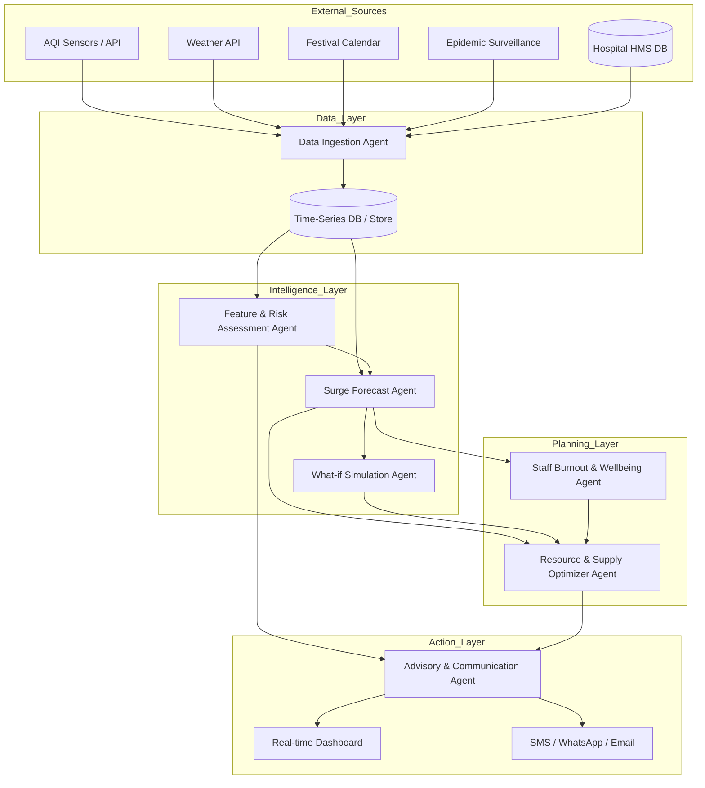

# HospAgent SurgeOps: Architecture & Design

## 1. High-Level Architecture

The **HospAgent SurgeOps** system is designed as a modular, event-driven architecture where autonomous agents collaborate to predict, assess, and manage hospital surges.



### Core Agents & Services

1.  **Data Ingestion Agent**: The gateway for all incoming data. Normalizes and stores data.
2.  **Feature & Risk Assessment Agent**: Computes real-time risk scores (0-100) based on multi-modal inputs.
3.  **Surge Forecast Agent**: Predicts patient loads for 3/7/14 days using ML models.
4.  **Resource & Supply Optimizer Agent**: Translates forecasts into actionable staffing and supply plans.
5.  **Staff Burnout & Wellbeing Agent**: Monitors staff load and recommends rotation/rest to prevent burnout.
6.  **What-if Simulation Agent**: Allows admins to run scenario analysis (e.g., "What if AQI doubles?").
7.  **Advisory & Communication Agent**: Generates human-readable alerts and advisories.

---

## 2. API Design & Data Models

### A. Data Ingestion Agent

**Base URL**: `/api/ingest`

*   **POST /events/patient**
    *   Ingest live patient events (admission, discharge, transfer).
    *   **Body**:
        ```json
        {
          "timestamp": "2025-11-24T10:00:00Z",
          "patient_id": "P12345",
          "event_type": "ADMISSION",
          "department": "ER",
          "complaint_category": "RESPIRATORY",
          "age_group": "ELDERLY",
          "triage_level": "RED"
        }
        ```

*   **POST /context/external**
    *   Ingest external environmental data manually or via webhook.
    *   **Body**:
        ```json
        {
          "timestamp": "2025-11-24T10:00:00Z",
          "aqi": 350,
          "weather": {"temp": 28, "humidity": 60, "rain": false},
          "epidemic_signals": {"dengue_cases_citywide": 45}
        }
        ```

### B. Feature & Risk Assessment Agent

**Base URL**: `/api/risk`

*   **GET /now**
    *   Get current real-time risk assessment.
    *   **Response**:
        ```json
        {
          "timestamp": "2025-11-24T10:05:00Z",
          "hospital_risk_index": 85,
          "level": "CRITICAL",
          "contributing_factors": [
            "AQI > 300 (Severe)",
            "Festival Weekend (Diwali)",
            "ER Occupancy > 90%"
          ],
          "department_risks": {
            "ER": 92,
            "Pulmonology": 88,
            "Pediatrics": 65
          }
        }
        ```

*   **GET /forecast**
    *   Get risk forecast for next N days.
    *   **Query Params**: `days=7`

### C. Surge Forecast Agent

**Base URL**: `/api/forecast`

*   **GET /patients**
    *   Predicted patient load.
    *   **Query Params**: `days=7`, `department=ER`
    *   **Response**:
        ```json
        {
          "forecast": [
            {
              "date": "2025-11-25",
              "predicted_total": 150,
              "breakdown": {"respiratory": 45, "trauma": 20, "viral": 30},
              "confidence_interval": [140, 160]
            }
          ]
        }
        ```

### D. Resource & Supply Optimizer Agent

**Base URL**: `/api/plan`

*   **GET /staffing**
    *   Recommended staffing levels.
    *   **Query Params**: `date=2025-11-25`
    *   **Response**:
        ```json
        {
          "date": "2025-11-25",
          "shifts": {
            "morning": {"doctors": 5, "nurses": 12, "support": 4},
            "evening": {"doctors": 4, "nurses": 10, "support": 3},
            "night": {"doctors": 3, "nurses": 8, "support": 2}
          },
          "alerts": ["Need +2 nurses for Night shift due to expected viral surge"]
        }
        ```

*   **GET /supplies**
    *   Supply requirements.
    *   **Response**:
        ```json
        {
          "items": [
            {"item": "Oxygen Cylinders", "required": 50, "current_stock": 45, "action": "ORDER_NOW"},
            {"item": "N-95 Masks", "required": 200, "current_stock": 500, "action": "OK"}
          ]
        }
        ```

### E. What-if Simulation Agent

**Base URL**: `/api/simulation`

*   **POST /run**
    *   Run a simulation scenario.
    *   **Body**:
        ```json
        {
          "scenario_name": "High Pollution Event",
          "modifications": {
            "aqi_multiplier": 1.5,
            "duration_days": 3
          }
        }
        ```
    *   **Response**:
        ```json
        {
          "impact": {
            "patient_increase_pct": 25,
            "resource_gaps": ["Oxygen", "Nebulizers"],
            "risk_index_change": "+15"
          }
        }
        ```

### F. Staff Burnout & Wellbeing Agent

**Base URL**: `/api/wellbeing`

*   **GET /burnout-risk**
    *   Get burnout risk scores for staff/departments.
    *   **Response**:
        ```json
        {
          "overall_risk": "MEDIUM",
          "high_risk_departments": ["ER", "ICU"],
          "recommendations": [
            "Rotate Dr. Sharma (ER) - 3 consecutive night shifts",
            "Mandatory break for ICU Nursing staff"
          ]
        }
        ```

---

## 3. Implementation Guidance

### Phase 1: Foundation & Data Ingestion
1.  **Setup Database**: Use SQLite for local dev, Supabase/Postgres for prod. Create tables for `patient_events`, `environmental_data`, `forecasts`.
2.  **Implement Data Ingestion Agent**: Create FastAPI endpoints to receive and validate data.

### Phase 2: Intelligence & Forecasting
1.  **Risk Engine**: Implement logic to normalize inputs (AQI, Occupancy) and compute a weighted average score.
2.  **Forecasting Model**: Use `scikit-learn` (RandomForest or Prophet) to train on historical data (simulated).

### Phase 3: Optimization & Action
1.  **Resource Optimizer**: Simple rule-based logic (e.g., 1 nurse per 5 patients) applied to forecasts.
2.  **Advisory Generator**: Use simple templates or a small LLM (if available) to generate text from structured risk data.

### Phase 4: Advanced Features
1.  **What-if Simulator**: Wrapper around the forecast model that temporarily modifies input features.
2.  **Burnout Agent**: Logic to track consecutive shifts and high-load hours.

---

## 4. Tech Stack Recommendation
*   **Backend**: Python (FastAPI) - High performance, easy ML integration.
*   **Database**: PostgreSQL (Supabase) + Redis (for caching real-time risk scores).
*   **ML**: Scikit-learn, Pandas.
*   **Task Queue**: Celery or Python `asyncio` background tasks for model retraining.
